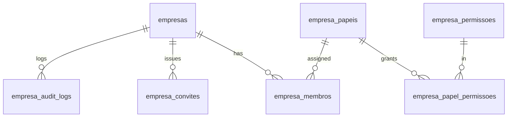
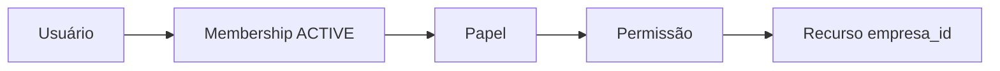
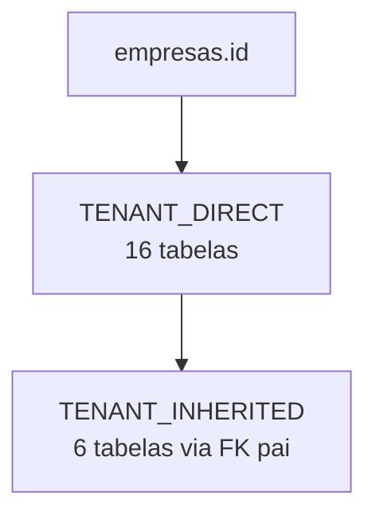
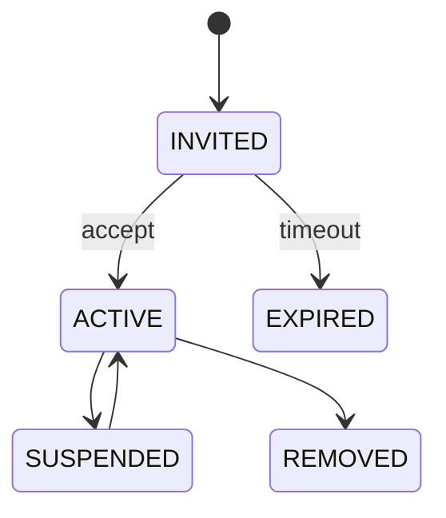

# ROSE-ME-F2 — Modelo Lógico Canônico Multiempresa, Contratos de Relacionamento, Mapeamento das Tabelas Atuais e RLS

**Framework:** ROSE-ME-F2 v1.0
**Programa:** ROSE_NATIVE_MULTITENANCY_TRANSFORMATION_PROGRAM (RNMTP)
**Aplicação-alvo:** GESTOR COMERCIAL E FINANCEIRO ROSÉ (resvercontrole.lovable.app)
**Framework pai:** ROSE-ME-F1
**Natureza:** 100% documental, lógica, read-only, fail-closed, zero mutation, zero breaking changes.

## 1. Precondições Reconciliadas
- F0: 20 artefatos, 612 checagens, 0 falhas. Baseline `689af23fb305255932cf86b48d4774775877d4a65061528e11b61487192a9a39`.
- F0-V1: 12 artefatos, 360 checagens. 53 índices, 100 constraints, 47 FKs.
- F1: 24 artefatos, 728 checagens. 15 princípios, 7 papéis, 42 permissões.

## 2. Entidades Canônicas (8)
`empresas`, `empresa_membros`, `empresa_papeis`, `empresa_permissoes`, `empresa_papel_permissoes`, `empresa_convites`, `usuario_empresa_preferencias`, `empresa_audit_logs`.

## 3. Mapeamento das 25 Tabelas Atuais
- TENANT_DIRECT: 16 (aportes_financeiros, bank_accounts, cartoes_credito, categorias_contas_pagar, company_settings, compras, controle_vendas_diario, controle_vendas_fornecedor, customers, finance_entries, payables, payment_routing_rules, products, receivables, sales, suppliers).
- TENANT_INHERITED_FROM_PARENT: 6 (bank_movements←bank_accounts, cartoes_faturas←cartoes_credito, cartoes_lancamentos←cartoes_faturas, compras_itens←compras, controle_vendas_fornecedor_historico←controle_vendas_fornecedor, sale_items←sales).
- AUDIT_SCOPED: 1 (audit_log → canonicalizada em `empresa_audit_logs`).
- MEMBERSHIP_SCOPED: 1 (user_roles → migrar para `empresa_membros`).
- USER_SCOPED: 1 (profiles).
- Total: 25 ✓.

## 4. Matriz empresa_id (23 candidatas)
- ADD_DIRECT_EMPRESA_ID: 17 (16 tenant_direct + audit_log).
- INHERIT_TENANT_FROM_REQUIRED_PARENT: 6.
- Total reconciliado: 23 ✓.

## 5. Papéis e Permissões
7 papéis × 42 permissões = 294 decisões atribuídas (ver matriz).

## 6. Contratos RLS
Deny-by-default; SELECT/INSERT/UPDATE/DELETE gated por membership ACTIVE + permissão + tenant. `empresa_id` imutável em UPDATE. FORCE RLS.

## 7. Compatibilidade
Empresa canônica candidata: *Angela Maria Momo Rodrigues MEI* (não criada). Baseline preservada.

## 8. Ordem F3
Ver artefato `..._INITIAL_COMPANY_COMPATIBILITY_BASELINE_AND_F3_DEPENDENCY_ORDER.json`.

## 9. Diagramas Mermaid

### ERD Canônico

### Fluxo de Autorização

### Tenant direto vs herdado

### Lifecycle

## 10. Decisão
- `readiness = READY_FOR_DETAILED_MIGRATION_BACKFILL_CONSTRAINT_INDEX_AND_ROLLBACK_DESIGN`
- `F3_authorized = false`
- `implementation_authorized = false`

Status: `ROSE_ME_F2_CANONICAL_LOGICAL_DATA_MODEL_AND_CONTRACTS_COMPLETED_AWAITING_EXPLICIT_AUTHORIZATION_FOR_ROSE_ME_F3`.
